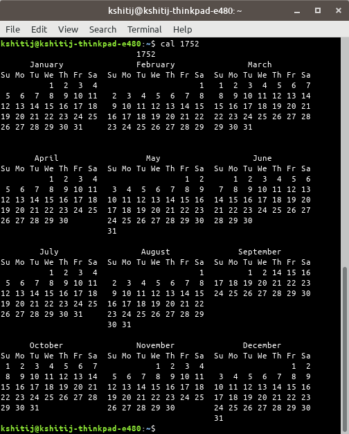
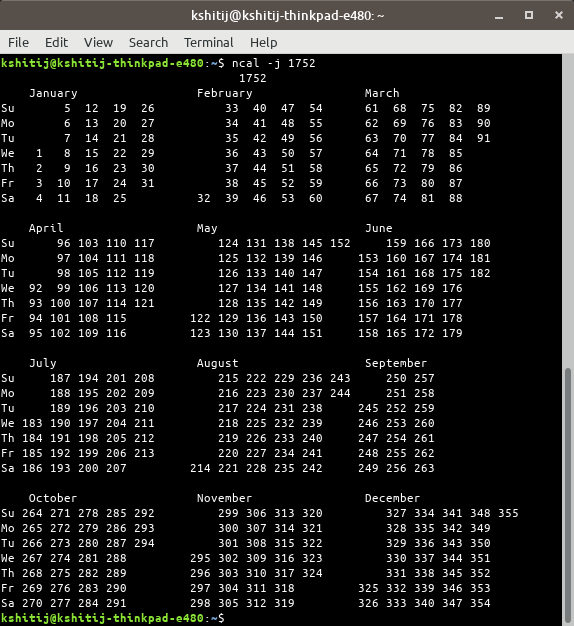
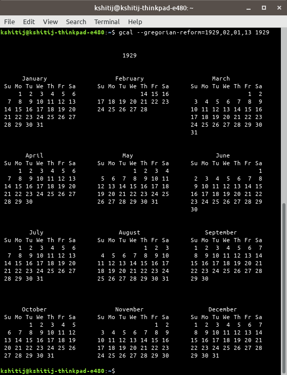
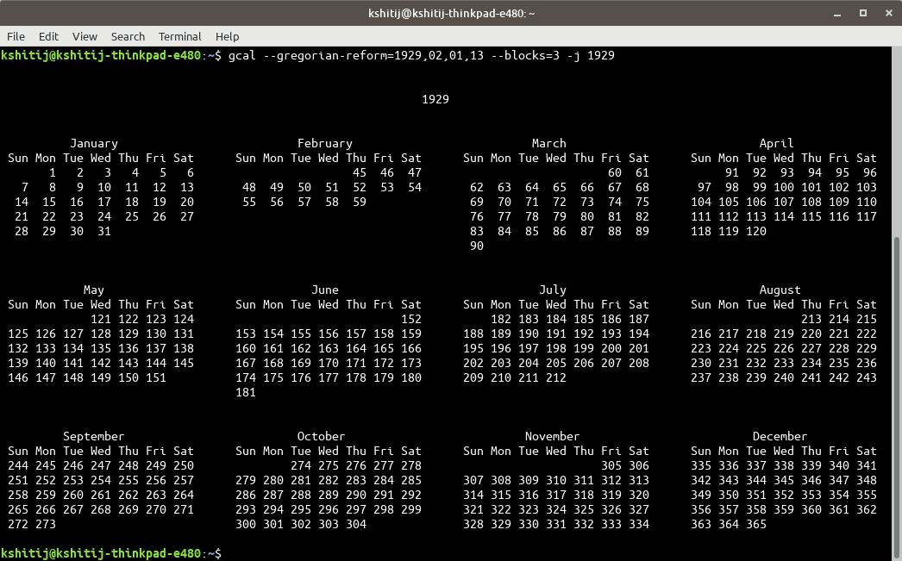

# calendar-ordinal

## Problem Statement

Xu the Great is playing a game of "Guess The Date" with his friend, Tromp the Pompous. Tromp the Pompous would pick a year between 1600 and 2600, and Xu the Great would have to guess the exact date of an obscure celebration in China known as the Chinese Sickle Day, which falls on the 244th day of the year. If Xu the Great guesses correctly, Tromp the Pompous would agree to trade his golf club collection with Xu the Great.

The tricky detail is that China switched from the Julian calendar to the Gregorian calendar on 31st January 1929; the next day was 14th February 1929. This means that 14th February 1929 is the 32nd day of the year 1929 in China.

Both calendars are largely the same, with February being the only month with a varying number of days depending on the year - 29 days during a leap year, 28 days otherwise. The only difference is in when the leap years fall. The following is the criteria for the leap years of both systems.

Julian calendar leap year must fulfil the following criterion:
```
divisible by 4
```
Gregorian calendar leap year must fulfil either 1 of the following criteria:
```
divisible by 400
divisible by 4 and not 100
```

Write a program to help Xu the Great guess it right every time. The input y (in 4 digits, eg. 2015) is the year that Tromp the Pompous asks about. Xu the Great would have to respond with an exact date, in the format of dd M yyyy, where dd is the day of the month with ordinals (eg. 1st, 2nd, 11th), MM is the month in the year fully spelt out (eg. February), yyyy is the year in 4 digits (eg. 2015). Please don't use any external date time libraries.

Sample Input

```2017```

Sample Output

```1st September 2017```

Have your program expect and wait for an input in the command-line after it's executed. Do provide clear instructions on how the input is meant to be given to your program.


## Usage

### Clone the repo
```
git clone https://github.com/krjj/calendar-ordinal.git
npm install or 
yarn
```
### Run

```
node index.js --args
```

### CLI Args
```
    -y  - year for which to calculate the date. (Default is 2017)
    -m  - mode (could be cal or gcal). (Default is 244)
    -o  - ordinal day (default is 244)
```

> If no arguments are passed default values will be used.

### Example

```
node index.js -y 2017 -m cal -o 244
```

### Modes

#### 1. cal
The script will behave similar to cal standard program available on unix or unix-like operating systems when it comes to handling gregorian reformation year. [Cal_(Unix)](https://en.wikipedia.org/wiki/Cal_(Unix))

The default gregorian reformation year for cal is 1752. During this year the adjusted days are shown as missing. [cal.1.html](http://man7.org/linux/man-pages/man1/cal.1.html)

<br/>
<strong>Cal year mode view</strong>

Run cmd on unix/linux terminal to get above output
```
cal 1752
```

<br/>
<strong>Display Julian days (days one-based, numbered from January 1)</strong>


Run cmd on unix/linux terminal to get above output
```
cal -j 1752 or ncal -j 1752
```

<i>Notice the number of days in a year in the output.</i>

#### 2. gcal

The script will behave similar to gnu cal program available when it comes to handling gregorian reformation year. [gcal](https://www.gnu.org/software/gcal/)

The default gregorian reformation year for cal is 1752. This can be overriden using cli options.

```
gcal --gregorian-reform=1929,02,01,13 1929
```

The screenshot below shows the calendar for the 1929 with the gregorian reform year as same.

<br/>
<strong>gcal year view</strong>


<br/>
<strong>Display Julian days (days one-based, numbered from January 1)</strong>

### Documentation

[Go to documentation](https://glints-task1-docs.netlify.com/symbols/_global_.html)

### Time Required

```
Reading/learning about calender which includes topics - 
Julian calendar
Gregorian calendar
Greogorian reformation
Ordinal Date
ISO 8061 Standard
Manual of cal
Manual of gnu cal
----------------------------------------------------------
1hr 30min

Implementation 
----------------------------------------------------------
45 Min
```
